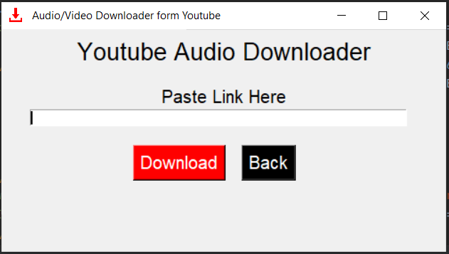
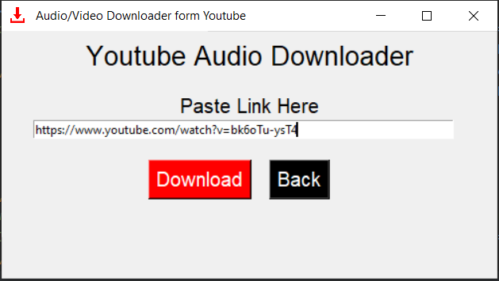

# Audio-Video-Downloader

# Description:

### This is a python code where you can download high-resolution videos and audio from youtube.

# How to use:
1. First you have to click on `Download ZIP` in the right panel.
2. Then extract it.
3. After that run `main.py`.
4. Now, you can see two options Audio Downloader and Video Downloader.
5. Choose your choice.
6. Copy link from youtube and paste there.
7. Then press Download button.
8. Downloaded file will be saved in your directory.

# ScreenShots:
### After run the program we'll see this window.

### We can select only one either audio or video. I've selected audio. We can find here a box for the link.

### I've paste the youtube link. And press the download button.

### Here we can see "Download Successful"

